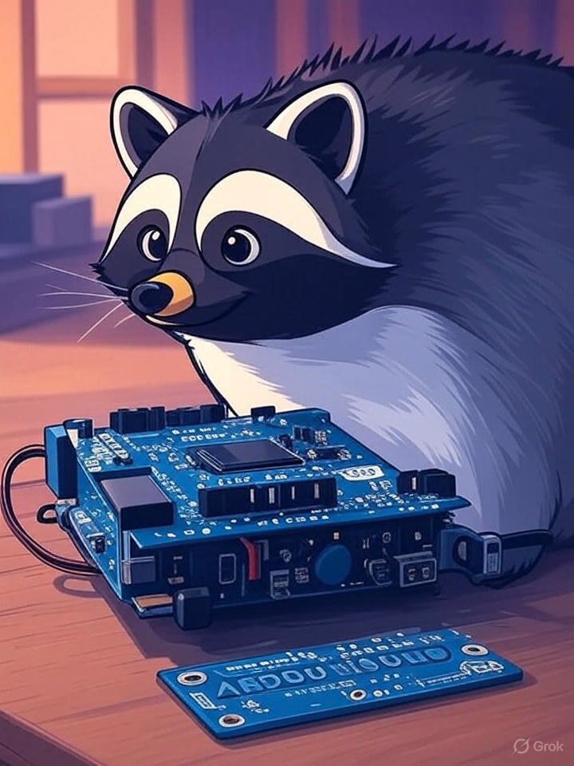

# 🚀 Unotrone OS — The Arduino Microcontroller Operating System


## 📄 License

This project is open for use, modification, and distribution **without any strict restrictions**, but please **give proper credit to the original author**:

`kishwordulal1234`

---

<p align="center">
Made with ❤️ by <a href="https://github.com/kishwordulal1234">kishwordulal1234</a>
</p>




<p align="center">
  <a href="https://github.com/kishwordulal1234/unotrone-os/stargazers">
    
  </a>
  <a href="https://github.com/kishwordulal1234/unotrone-os/network/members">
    
  </a>
  <a href="https://github.com/kishwordulal1234/unotrone-os/blob/main/LICENSE">
    
  </a>
</p>

---

## 🧠 What is **Unotrone OS**?

Unotrone OS is a **lightweight, minimalist operating system** crafted specifically for Arduino Uno, Nano, and AVR-based microcontrollers.  
It transforms your Arduino into a **multitasking machine**, empowering you to run multiple tasks simultaneously — no RTOS needed!

> _"Give your Arduino a brain that can think and multitask!"_

---

## ⚡ Why Unotrone OS?

- 🚦 **Multitasking without the complexity** — cooperative task scheduling that fits on microcontrollers  
- 🧑‍🏫 **Learn OS internals** — perfect playground for OS concepts on embedded hardware  
- ⚙️ **Modular & customizable** — extend or strip down to your needs  
- 💾 **Tiny footprint** — optimized for limited MCU memory and processing power  
- 🔧 **Open source** — tweak, fork, and innovate!

---

## 🎯 Uses

- Upload the code to your Arduino Uno or Nano using the Arduino IDE or via the provided `.bin` file.  
- Open the **Serial Monitor** in the Arduino IDE.  
- Press the **Reset** button on your Arduino board.  
- Watch your OS come to life as it starts running tasks right away!

Unotrone OS is perfect for:

- Educational demos and embedded OS experimentation  
- Running simple multitasking projects on low-power microcontrollers  
- Learning about scheduling and resource management on bare-metal systems

---

## 🛠️ Quick Start Guide

### Prerequisites

- Arduino Uno, Nano, or compatible AVR board  
- Arduino IDE (v1.8.19 or newer)  
- USB cable for programming  

### Installation

```bash
git clone https://github.com/kishwordulal1234/unotrone-os.git
